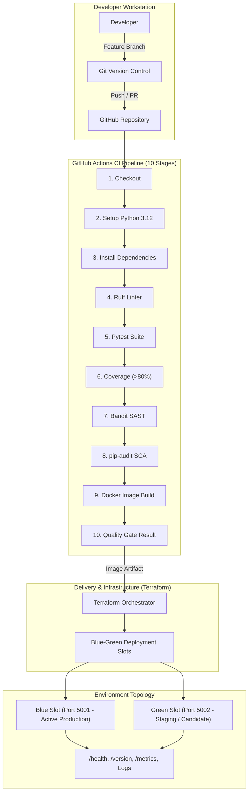
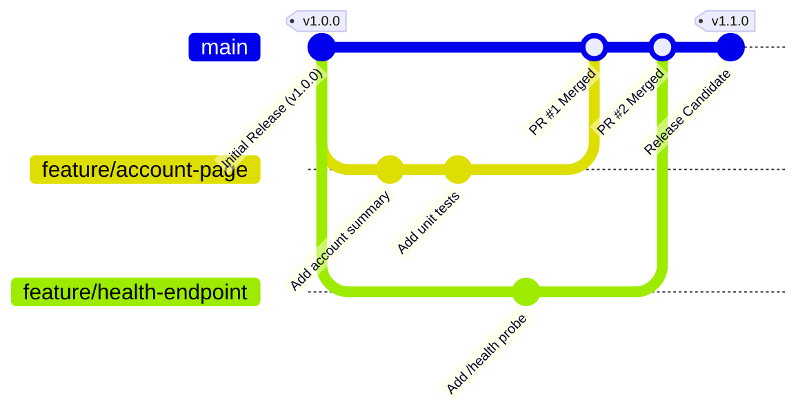

# FinTechFlow – DevOps Demonstration

[](.github/workflows/ci.yml)
[](https://www.python.org/)
[](https://flask.palletsprojects.com/)
[-success.svg)](tests/)
[](docs/SECURITY.md)
[](#)

> **Academic Disclaimer:** This repository is an educational DevOps assessment demonstration project created to solve **Scenario 1: The Fintech App with Painful Release Weekends**. It contains **only synthetic mock data** and does not process real financial transactions, banking integrations, or real customer data.

---

## Table of Contents
1. [Project Overview](#1-project-overview)
2. [Scenario Background](#2-scenario-background)
3. [Problem Statement](#3-problem-statement)
4. [DevOps Objectives](#4-devops-objectives)
5. [Technology Stack](#5-technology-stack)
6. [System Architecture](#6-system-architecture)
7. [Project Structure](#7-project-structure)
8. [Local Setup & Execution](#8-local-setup--execution)
9. [Running Automated Tests](#9-running-automated-tests)
10. [Running with Docker & Docker Compose](#10-running-with-docker--docker-compose)
11. [CI/CD Pipeline (GitHub Actions)](#11-cicd-pipeline-github-actions)
12. [Security & DevSecOps Scanning](#12-security--devsecops-scanning)
13. [Infrastructure as Code (Terraform)](#13-infrastructure-as-code-terraform)
14. [Blue-Green Deployment Strategy](#14-blue-green-deployment-strategy)
15. [Rollback & Incident Recovery](#15-rollback--incident-recovery)
16. [Observability & Monitoring](#16-observability--monitoring)
17. [Git Branching & Release Workflow](#17-git-branching--release-workflow)
18. [Demonstration Limitations](#18-demonstration-limitations)
19. [Future Production Improvements](#19-future-production-improvements)

---

## 1. Project Overview

**FinTechFlow** is a lightweight, cloud-ready fintech web application accompanied by a modern DevOps delivery pipeline. The project demonstrates how modern software engineering practices—continuous integration, automated quality gates, containerisation, infrastructure as code, shift-left security, zero-downtime blue-green deployments, and proactive observability—completely eliminate traditional deployment failures.

---

## 2. Scenario Background

In **Scenario 1 ("The Fintech App with Painful Release Weekends")**, an established financial services provider suffered from severe release bottlenecks:
- **Long Release Cycles**: Software releases occurred only once every **12 weeks**, resulting in massive, high-risk changesets.
- **Extreme Staffing Burden**: Each release weekend required **~30 engineers and managers** on standby for manual deployment and verification.
- **Frequent Rollbacks**: Each release suffered **2–4 rollbacks**, incurring hours of service downtime and customer disruption.
- **Manual Deployments**: Engineers manually copied files, configured servers, and ran manual database scripts.
- **Weak Automated Testing**: Testing was conducted manually late in the release cycle, missing critical regressions.
- **Late Security Reviews**: Security reviews took place immediately before go-live, leading to emergency cancellations and panic.

---

## 3. Problem Statement

How can an organization transition from high-stress, 12-week manual release weekends to **automated, frequent, zero-downtime, and fully recoverable software deliveries** while maintaining financial-grade security and code quality?

---

## 4. DevOps Objectives

| Objective | Target Outcome | Solved in FinTechFlow Via |
| :--- | :--- | :--- |
| **1. Automate Quality & Testing** | Fast feedback on every commit (< 2 min) | Pytest automated test suite with strict coverage enforcement (>80%). |
| **2. Eliminate Manual Deployment** | Repeatable, immutable container artifacts | Multi-stage Dockerfile and Docker Compose orchestration. |
| **3. Shift-Left Security** | Early vulnerability detection in CI | Bandit (SAST) and pip-audit (SCA) automated pipeline stages. |
| **4. Zero-Downtime Releases** | Eliminate release maintenance windows | Blue-Green deployment slots with automated health gating. |
| **5. Sub-Minute Recovery (MTTR)** | Instant rollbacks without downtime | Rapid traffic redirection to the warm Blue standby slot (< 30s). |
| **6. Reproducible Environments** | Eliminate configuration drift | Terraform Infrastructure as Code and declarative container configs. |

---

## 5. Technology Stack

- **Backend Web Framework**: Python 3.12 / 3.13, Flask 3.1.3, Werkzeug 3.1.8
- **WSGI Production Server**: Gunicorn 23.0.0
- **Automated Testing & Coverage**: Pytest 9.1.1, Pytest-Cov 6.0.0
- **Linting & Code Formatting**: Ruff 0.16.5
- **Security Scanning (SAST & SCA)**: Bandit 1.9.4, pip-audit 2.10.1
- **Containerisation & Orchestration**: Docker, Docker Compose
- **Continuous Integration (CI/CD)**: GitHub Actions
- **Infrastructure as Code (IaC)**: Terraform (>= 1.5.0)
- **Version Control**: Git & GitHub (Feature branch / Pull Request workflow)

---

## 6. System Architecture



For complete architectural details, see [docs/ARCHITECTURE.md](docs/ARCHITECTURE.md).

---

## 7. Project Structure

```
fintech-devops-scenario1/
│
├── app/                             # Core Application Source Code
│   ├── __init__.py                  # App factory, middleware, security headers, error handlers
│   ├── routes.py                    # Web views & DevOps API routes (/health, /version, /metrics)
│   ├── services.py                  # Domain mock services (Account, Transactions, Metrics, Health)
│   ├── config.py                    # Environment configuration profiles (Dev, Test, Stage, Prod)
│   └── templates/                   # Semantic UI HTML Templates
│       ├── base.html                # Base layout with navbar & environment badge
│       ├── index.html               # Main dashboard with live API test console
│       ├── account.html             # Mock account overview with demo notice
│       ├── transactions.html        # Mock transactions feed
│       ├── 404.html                 # Custom 404 error page
│       └── 500.html                 # Custom 500 error page
│
├── tests/                           # Automated Test Suite (18 tests, 97% coverage)
│   ├── conftest.py                  # Pytest fixtures & isolated test client
│   ├── test_health.py               # /health endpoint validation
│   ├── test_version.py              # /version endpoint validation
│   ├── test_account.py              # Account UI and API endpoint tests
│   ├── test_transactions.py         # Transactions UI and API endpoint tests
│   └── test_routes.py               # Dashboard, 404 handlers, metrics & config tests
│
├── terraform/                       # Infrastructure as Code (IaC)
│   ├── main.tf                      # Cloud infrastructure model & manifest generator
│   ├── variables.tf                 # Parameterized inputs (environment, ports, active slot)
│   ├── outputs.tf                   # Deployment endpoints and status outputs
│   └── README.md                    # IaC architecture & usage guide
│
├── .github/
│   └── workflows/
│       └── ci.yml                   # 10-Stage GitHub Actions CI Pipeline
│
├── docs/                            # Comprehensive Documentation Suite
│   ├── ARCHITECTURE.md              # Deep-dive architecture & Scenario 1 problem mapping
│   ├── CICD.md                      # CI/CD pipeline design and quality gates
│   ├── ROLLBACK.md                  # Step-by-step incident response & rollback runbook
│   ├── SECURITY.md                  # Shift-left DevSecOps (SAST, SCA, hardening)
│   ├── OBSERVABILITY.md             # Telemetry, metrics, structured logs, and health checks
│   └── DEPLOYMENT.md                # Environment topology & Blue-Green deployment simulation
│
├── Dockerfile                       # Multi-stage minimal production Dockerfile (non-root)
├── docker-compose.yml               # Local development & container testing
├── docker-compose.bluegreen.yml     # Blue-Green deployment simulation (Ports 5001 & 5002)
├── requirements.txt                 # Pinned production runtime dependencies
├── requirements-dev.txt             # Pinned development, testing, and security tooling
├── pyproject.toml                   # Ruff, Pytest, and Coverage tool configuration
├── .env.example                     # Safe placeholder environment variables
├── .gitignore                       # Git exclusion rules
├── .dockerignore                    # Docker build exclusion rules
├── CHANGELOG.md                     # Semantic version history (Keep a Changelog)
└── README.md                        # Master project documentation
```

---

## 8. Local Setup & Execution

### Prerequisites
- Python 3.12 or 3.13
- Git

### Step-by-Step Local Setup

1. **Clone or Navigate to the Repository**:
   ```bash
   cd fintech-devops-scenario1
   ```

2. **Create and Activate a Virtual Environment**:
   - **Linux / macOS**:
     ```bash
     python3 -m venv .venv
     source .venv/bin/activate
     ```
   - **Windows (PowerShell)**:
     ```powershell
     py -m venv .venv
     .\.venv\Scripts\Activate.ps1
     ```

3. **Install Dependencies**:
   ```bash
   pip install --upgrade pip
   pip install -r requirements-dev.txt
   ```

4. **Launch the Application**:
   ```bash
   python -c "from app import create_app; create_app().run(host='127.0.0.1', port=5000, debug=True)"
   ```
   Open your browser at `http://127.0.0.1:5000`.

---

## 9. Running Automated Tests

The project includes an automated test suite with **18 unit, integration, and API tests** achieving **97% code coverage**.

```bash
# Run test suite quickly:
pytest -q

# Run test suite with full coverage report:
pytest --cov=app --cov-report=term-missing
```

**Expected Output:**
```
..................                                                       [100%]
---------- coverage: platform win32, python 3.13 ----------
Name              Stmts   Miss  Cover   Missing
-----------------------------------------------
app\__init__.py      58      7    88%   32-34, 147-162
app\config.py        36      0   100%
app\routes.py        63      0   100%
app\services.py      52      0   100%
-----------------------------------------------
TOTAL               209      7    97%
```

---

## 10. Running with Docker & Docker Compose

### Build and Run Single Container
```bash
# 1. Build the Docker image
docker build -t fintechflow:1.0.0 .

# 2. Run the container
docker run -p 5000:5000 fintechflow:1.0.0

# 3. Verify health
curl http://localhost:5000/health
```

### Run with Docker Compose
```bash
# Start container in detached mode
docker compose up --build -d

# Check running status and health check
docker compose ps

# View live container logs
docker compose logs -f

# Stop and remove containers
docker compose down
```

---

## 11. CI/CD Pipeline (GitHub Actions)

The pipeline (`.github/workflows/ci.yml`) enforces **10 automated stages**:

```
STAGE 1: CHECKOUT REPOSITORY
   ↓
STAGE 2: SET UP PYTHON 3.12
   ↓
STAGE 3: INSTALL DEPENDENCIES (requirements-dev.txt)
   ↓
STAGE 4: LINT WITH RUFF (ruff check .)
   ↓
STAGE 5: RUN PYTEST SUITE (pytest -q)
   ↓
STAGE 6: VERIFY COVERAGE (pytest-cov > 80%)
   ↓
STAGE 7: SAST SCAN (bandit -r app)
   ↓
STAGE 8: SCA AUDIT (pip-audit)
   ↓
STAGE 9: DOCKER CONTAINER BUILD (docker build)
   ↓
STAGE 10: CI QUALITY GATE RESULT
```

If any single quality gate fails, the pipeline halts immediately, preventing defective code from reaching staging or production.

---

## 12. Security & DevSecOps Scanning

Run all security checks locally:

```bash
# 1. Code Quality & PEP 8 Linter
ruff check .

# 2. Static Application Security Testing (SAST)
bandit -r app

# 3. Software Composition Analysis (SCA)
pip-audit
```

For complete DevSecOps details, see [docs/SECURITY.md](docs/SECURITY.md).

---

## 13. Infrastructure as Code (Terraform)

Terraform declaratively models infrastructure provisioning and blue-green routing slots without cloud costs:

```bash
cd terraform

# Format validation
terraform fmt -check

# Configuration validation
terraform validate

# Plan and Apply
terraform init
terraform apply -auto-approve
```

For full details, see [terraform/README.md](terraform/README.md).

---

## 14. Blue-Green Deployment Strategy

FinTechFlow includes a complete local simulation of Blue-Green deployment slots:

```bash
# Start Blue (Port 5001 - v1.0.0) and Green (Port 5002 - v1.1.0)
docker compose -f docker-compose.bluegreen.yml up --build -d

# Query Blue (Active Production):
curl http://localhost:5001/version

# Validate Green (Release Candidate) before traffic cutover:
curl http://localhost:5002/health
```

For full instructions, see [docs/DEPLOYMENT.md](docs/DEPLOYMENT.md).

---

## 15. Rollback & Incident Recovery

If anomalies or errors are detected on the new release:
1. Traffic routing is instantly redirected back to the warm Blue slot (Port 5001).
2. Downtime: **0 seconds**.
3. Mean Time to Recover: **< 30 seconds** (vs. 2–6 hours in Scenario 1).
4. The failing container remains isolated for forensic root cause analysis.

For the complete runbook, see [docs/ROLLBACK.md](docs/ROLLBACK.md).

---

## 16. Observability & Monitoring

The application provides three live telemetry endpoints:
- **`GET /health`**: Health status probe for load balancers and container runtimes.
- **`GET /version`**: Semantic version string for deployment verification.
- **`GET /metrics`**: In-memory operational metrics (request count, success count, failure count, uptime).

For full details, see [docs/OBSERVABILITY.md](docs/OBSERVABILITY.md).

---

## 17. Git Branching & Release Workflow

FinTechFlow utilizes a short-lived **Feature Branch Workflow**:



1. Developers branch from `main` (`feature/feature-name`).
2. Local tests, linter, and security checks are executed before commit.
3. Developer submits a Pull Request against `main`.
4. GitHub Actions CI pipeline runs all 10 stages automatically.
5. Peer review approval is recorded.
6. PR is merged into `main` and tagged with semantic versioning (`v1.0.0`, `v1.1.0`).

---

## 18. Demonstration Limitations

1. **Simulated Financial Data**: All account balances, transactions, and user names are hardcoded mock fixtures for educational demonstration.
2. **In-Memory Metrics**: Metrics are tracked in memory and reset upon application restart (not a replacement for Prometheus/Datadog in production).
3. **Local Container Simulation**: Blue-Green deployment is simulated locally via distinct host port bindings (ports 5001 and 5002) rather than a cloud Application Load Balancer.

---

## 19. Future Production Improvements

1. **Cloud Orchestration**: Deploy containers onto Kubernetes (EKS / GKE / AKS) with ArgoCD GitOps controllers.
2. **Distributed Tracing**: Integrate OpenTelemetry and Jaeger for distributed transaction tracing.
3. **Automated Canary Analysis**: Implement Flagger or Istio service meshes for progressive traffic shifting (10% -> 25% -> 50% -> 100%) based on automated error budget metrics.
4. **Cloud Secret Management**: Integrate HashiCorp Vault or AWS Secrets Manager for dynamic database credential rotation.
