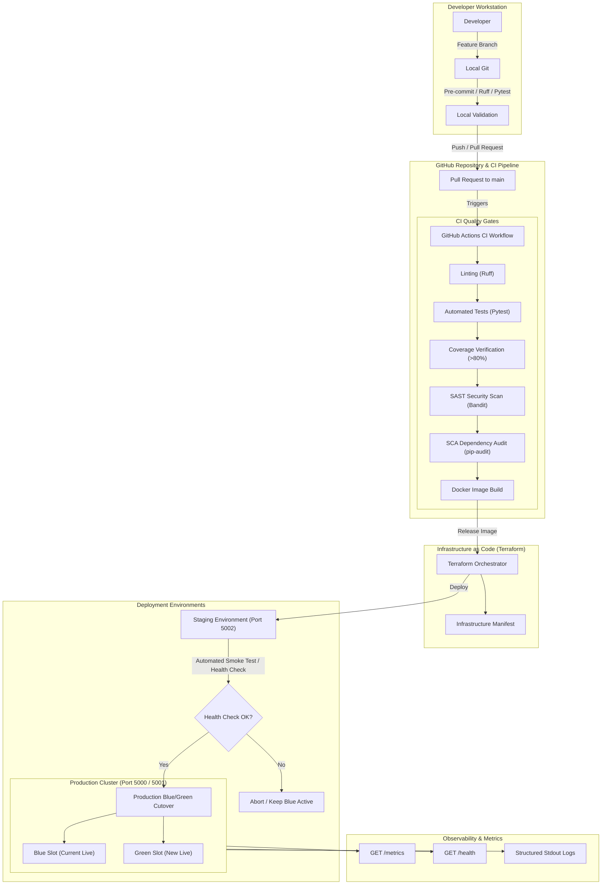

# FinTechFlow – System Architecture Documentation

## 1. Executive Summary & Scenario Context

This architecture addresses the operational dysfunctions outlined in **DevOps Scenario 1: The Fintech App with Painful Release Weekends**.

### Baseline Scenario Challenges vs. Architectural Solutions

| Pain Point in Scenario 1 | Architectural Root Cause | DevOps Architectural Solution | Key Metric Impact |
| :--- | :--- | :--- | :--- |
| **12-Week Release Cadence** | Monolithic, unautomated release procedures causing batch size accumulation. | Automated Continuous Integration & Delivery (CI/CD) pipelines with modular services. | Deployment frequency increased from 12 weeks to on-demand daily/weekly releases. |
| **30 Staff on Release Weekends** | Manual coordination, lack of self-healing deployment pipelines, manual smoke checks. | Infrastructure as Code (Terraform) and container orchestration (Docker/Compose). | Release staffing reduced from 30 engineers to 1-2 on-call engineers. |
| **2–4 Rollbacks per Release** | Big-bang deployments directly to production without staging parity or health verification. | Zero-downtime Blue-Green deployment architecture with automated pre-cutover health gates. | Production outage risk reduced to zero; rollback time reduced from hours to seconds. |
| **Weak Automated Testing** | Manual QA testing at the end of the release cycle. | Pytest test suite with strict code coverage (>90%) gating pipeline progression. | Immediate test feedback within 2 minutes of pull request submission. |
| **Late Security Reviews** | Security checks performed manually just before go-live, causing blocking delays. | Shift-Left DevSecOps incorporating SAST (Bandit) and SCA (pip-audit) directly into CI. | Security vulnerabilities detected and remediated during feature branch development. |

---

## 2. End-to-End System Architecture



---

## 3. Application Component Breakdown

The **FinTechFlow** application is designed following clean architecture, separation of concerns, and Twelve-Factor App principles:

```
app/
├── __init__.py      # Application factory (create_app), middleware, security headers, error handlers
├── config.py        # Environment-driven configuration (Development, Testing, Staging, Production)
├── routes.py        # Web views (Dashboard, Account, Transactions) & DevOps APIs (/health, /version, /metrics)
├── services.py      # Domain services (AccountService, TransactionService, MetricsService, HealthService)
└── templates/       # Semantic HTML5 templates with responsive CSS design system
    ├── base.html
    ├── index.html
    ├── account.html
    ├── transactions.html
    ├── 404.html
    └── 500.html
```

### Component Roles & Responsibilities

1. **Application Factory (`create_app`)**:
   - Creates and configures Flask instances dynamically based on environment profiles.
   - Attaches centralized request timing middleware.
   - Enforces HTTP response security headers (`Content-Security-Policy`, `X-Content-Type-Options: nosniff`, `X-Frame-Options: DENY`, `X-XSS-Protection`).
   - Registers error handlers returning HTML for browser clients and structured JSON for REST consumers.

2. **Configuration Profiles (`config.py`)**:
   - Implements hierarchical configuration classes: `DevelopmentConfig`, `TestingConfig`, `StagingConfig`, `ProductionConfig`.
   - Reads runtime variables from the environment (`APP_NAME`, `APP_VERSION`, `ENVIRONMENT`, `PORT`, `LOG_LEVEL`, `SECRET_KEY`).
   - Ensures no production secrets are ever committed or hardcoded in source files.

3. **Domain & Observability Services (`services.py`)**:
   - **`AccountService`**: Generates simulated mock account summary data for "Demo User" with balance, limits, and explicit demo notices.
   - **`TransactionService`**: Supplies deterministic simulated transactions for automated testing and UI demonstration.
   - **`MetricsService`**: Thread-safe in-memory counter tracking request volumes, success rates, failure rates, and service uptime.
   - **`HealthService`**: Evaluates system readiness for load balancers and deployment gates.

4. **REST APIs & Web Routes (`routes.py`)**:
   - UI views for real-time stakeholder inspection.
   - DevOps endpoints:
     - `GET /health`: Machine-readable health probe for Docker and CI/CD.
     - `GET /version`: Semantic version readout for post-deployment smoke verification.
     - `GET /metrics`: Application observability payload.

---

## 4. Containerisation & Portability

- **Base Image**: `python:3.12-slim` minimizes attack surface and image size.
- **Least-Privilege Security**: Runs as non-root user `appuser` (UID 10001).
- **Production Server**: Serves requests via `gunicorn` with worker/thread pools and direct stdout/stderr logging.
- **Container Healthcheck**: Native Python health check probe requiring zero external binaries (e.g., `curl` or `wget`).

---

## 5. Summary

This architecture replaces error-prone manual deployment weekends with a resilient, automated, test-driven, and secure software delivery supply chain.
