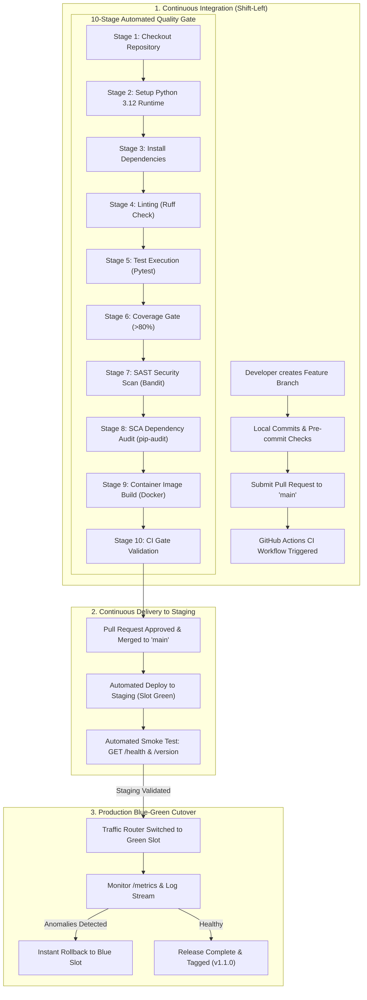

# FinTechFlow – CI/CD Pipeline & Delivery Lifecycle

## 1. CI/CD Strategy Overview

In **Scenario 1**, the company operated with:
- Long 12-week release cycles resulting in massive changesets.
- Manual deployment scripts executed across dozens of servers by 30 engineers over weekends.
- Uncoordinated testing leading to repeated production failures and rollbacks.

The **FinTechFlow CI/CD Strategy** introduces automated quality gates, automated testing, container builds, and pre-deployment smoke checks.

---

## 2. Complete Delivery Lifecycle Flow



---

## 3. GitHub Actions CI Pipeline Stages Explained

The CI workflow (`.github/workflows/ci.yml`) executes automatically on every `push` and `pull_request` against the `main` branch.

| Stage | Action / Tool | Purpose & Scenario 1 Problem Solved | Pass Criteria |
| :--- | :--- | :--- | :--- |
| **Stage 1: Checkout** | `actions/checkout@v4` | Pulls repository codebase with complete commit history. | Git repository cloned cleanly. |
| **Stage 2: Setup Python** | `actions/setup-python@v5` | Provisions Python 3.12 execution environment with pip caching. | Python runtime initialized. |
| **Stage 3: Dependencies** | `pip install` | Installs pinned runtime and test packages from `requirements-dev.txt`. | Zero package installation errors. |
| **Stage 4: Code Quality** | `ruff check .` | Enforces code formatting, PEP 8 rules, unused import cleanup, and Python modernizations. | Zero linting errors or warnings. |
| **Stage 5: Test Execution** | `pytest -q` | Executes 18 unit, API, configuration, and integration tests. | 100% test pass rate. |
| **Stage 6: Code Coverage** | `pytest-cov` | Generates coverage metrics and enforces test coverage threshold (>80%). | App coverage > 80% (Current: 97%). |
| **Stage 7: SAST Scan** | `bandit -r app` | Performs Static Application Security Testing on AST for security flaws. | Zero high/medium security issues. |
| **Stage 8: SCA Audit** | `pip-audit` | Audits third-party dependencies against PyPA vulnerability database. | Zero known vulnerable packages. |
| **Stage 9: Docker Build** | `docker build` | Builds immutable container image with multi-stage non-root containerfile. | Docker image successfully builds. |
| **Stage 10: CI Gate** | Shell summary | Synthesizes stage outcomes and authorizes progression to staging deployment. | All previous 9 stages green. |

---

## 4. Pipeline Execution Commands (Local Replication)

To reproduce the exact CI pipeline checks on a local workstation before submitting a Pull Request:

```bash
# Activate virtual environment
source .venv/bin/activate  # (Linux/macOS)
.\.venv\Scripts\Activate.ps1 # (Windows PowerShell)

# Step 1: Linting
ruff check .

# Step 2: Automated Tests & Coverage
pytest -q
pytest --cov=app --cov-report=term-missing

# Step 3: Security Scans
bandit -r app
pip-audit

# Step 4: Docker Container Build
docker build -t fintechflow:local .
```

---

## 5. Pull Request Quality Gate Rules

In a production GitHub repository, branch protection rules on `main` ensure:
1. **Require Status Checks to Pass**: `Continuous Integration & Quality Gates` must be green before merging.
2. **Require Code Review**: At least 1 peer approval required.
3. **No Direct Pushes**: All changes must arrive via pull request branches.
4. **Up-to-date Branches**: Branch must be rebased or merged with latest `main` before merge.
