# FinTechFlow – Deployment & Environment Strategy

## 1. Environment Topology & Consistency

In **Scenario 1**, development, staging, and production environments suffered from severe **configuration drift**:
- Software deployed to staging frequently behaved differently in production due to manual server configurations.
- Developers tested code against unstandardized local setups, leading to the classic *"it worked on my machine"* syndrome.

To solve this, FinTechFlow standardizes configuration across three discrete, containerized environments:

```mermaid
graph LR
    subgraph DevEnv ["1. Development Environment"]
        DevLocal["Local Docker Compose / .venv"]
        DevTarget["Fast Feedback Loop<br/>Hot-reload & Debugging"]
    end

    subgraph StageEnv ["2. Staging Environment"]
        StageDocker["Staging Slot (Green: Port 5002)"]
        StageTarget["Exact Production Replica<br/>Automated Smoke Tests & Verification"]
    end

    subgraph ProdEnv ["3. Production Environment"]
        ProdBlue["Blue Slot (Port 5001 - Active)"]
        ProdGreen["Green Slot (Port 5002 - Warm Standby)"]
        ProdTarget["Restricted Access<br/>Zero-Downtime Cutover<br/>Instant Rollback (<30s)"]
    end

    DevEnv -->|"Automated PR & CI"| StageEnv
    StageEnv -->|"Automated Health Check OK"| ProdEnv
```



---

## 2. Environment Comparison Matrix

| Dimension | Development | Staging | Production |
| :--- | :--- | :--- | :--- |
| **Purpose** | Feature development & unit testing | Pre-release validation & smoke testing | Live customer traffic |
| **Access Control** | Open to development team | CI/CD automated pipeline | Restricted, audit-logged access |
| **Configuration Profile** | `DevelopmentConfig` (`FLASK_DEBUG=1`) | `StagingConfig` (`FLASK_DEBUG=0`) | `ProductionConfig` (`FLASK_DEBUG=0`) |
| **Logging Level** | `DEBUG` | `INFO` | `INFO` |
| **Deployment Strategy** | Direct `docker compose up` | Automated release candidate slot | Zero-downtime Blue-Green deployment |
| **Rollback Mechanism** | Local code edit / restart | Pipeline re-run | Instant load balancer target switch |

---

## 3. Blue-Green Deployment Simulation (Hands-On Demonstration)

This project provides a complete, local simulation of a **Blue-Green Deployment** using `docker-compose.bluegreen.yml`.

### Step 1: Launch Both Environments
Start the current production baseline (**Blue**) and new release candidate (**Green**):

```bash
docker compose -f docker-compose.bluegreen.yml up --build -d
```

Verify running containers:
```bash
docker compose -f docker-compose.bluegreen.yml ps
```

---

### Step 2: Verify Active Production (Blue Slot - Port 5001)
Query the current live production application:

```bash
curl http://localhost:5001/version
```
**Output:**
```json
{
  "service": "FinTechFlow [BLUE]",
  "version": "1.0.0",
  "environment": "production"
}
```

---

### Step 3: Run Automated Smoke Tests against Candidate (Green Slot - Port 5002)
Before routing user traffic to the new release, automated health probes inspect the Green candidate:

```bash
curl http://localhost:5002/health
```
**Output:**
```json
{
  "status": "healthy",
  "service": "FinTechFlow [GREEN]",
  "version": "1.1.0",
  "environment": "staging"
}
```

---

### Step 4: Zero-Downtime Traffic Promotion
Once the green candidate passes health and smoke checks, traffic is routed to port 5002 (Green becomes the new active production slot). The Blue slot (port 5001) remains active in the background as a warm standby.

---

### Step 5: Instant Rollback Simulation
If an anomaly is detected on the new release:
1. Traffic routing is immediately switched back to Blue on port 5001.
2. Downtime: **0 seconds**.
3. Mean Time to Recover: **< 30 seconds**.
4. The green slot remains isolated for debugging and log inspection.

---

### Step 6: Teardown Simulation
```bash
docker compose -f docker-compose.bluegreen.yml down
```
