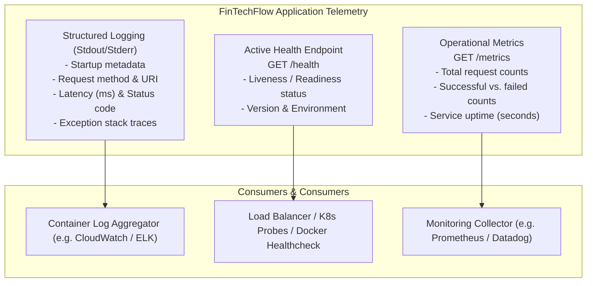

# FinTechFlow – Observability & Monitoring Architecture

## 1. Context: Lack of Observability in Scenario 1

In **Scenario 1**, operational visibility was virtually non-existent:
- Release teams relied on customer complaints or manual spot checks during release weekends to detect issues.
- When an outage occurred, engineers spent hours reading unformatted server files to identify root causes.
- Rollbacks were delayed because teams lacked definitive metrics to confirm whether the new version was healthy.

The **FinTechFlow Observability Pattern** establishes three core pillars of telemetry: **Metrics**, **Structured Logs**, and **Active Health Probes**.

---

## 2. Telemetry Pillars Overview



---

## 3. Endpoints & Telemetry Specifications

### A. Health Check Endpoint (`GET /health`)
Used by Docker health checks, CI/CD smoke tests, and load balancers to evaluate instance readiness:

```bash
curl http://localhost:5000/health
```

**JSON Response (HTTP 200 OK):**
```json
{
  "status": "healthy",
  "service": "FinTechFlow",
  "version": "1.0.0",
  "environment": "production",
  "timestamp": "2026-08-29T08:00:00.000000+00:00"
}
```

---

### B. Release Version Endpoint (`GET /version`)
Used by post-deployment automation to verify that the desired release artifact is actively serving traffic:

```bash
curl http://localhost:5000/version
```

**JSON Response (HTTP 200 OK):**
```json
{
  "service": "FinTechFlow",
  "version": "1.0.0",
  "environment": "production"
}
```

---

### C. Operational Metrics Endpoint (`GET /metrics`)
Provides in-memory operational metrics for real-time error rate tracking and traffic analysis:

```bash
curl http://localhost:5000/metrics
```

**JSON Response (HTTP 200 OK):**
```json
{
  "service": "FinTechFlow",
  "uptime_seconds": 128.45,
  "total_requests": 42,
  "successful_requests": 41,
  "failed_requests": 1,
  "endpoint_hits": {
    "/": 15,
    "/health": 20,
    "/account": 5,
    "/non-existent": 2
  },
  "timestamp": "2026-08-29T08:05:00.000000+00:00",
  "note": "Demonstration in-memory metrics only - not production APM."
}
```

---

## 4. Structured Application Logging

Logging is implemented using Python’s standard `logging` library, formatting messages directly to `stdout` and `stderr` for Docker container log collection:

```
[2026-08-29 08:00:01] [INFO] [fintechflow.app] Initializing FinTechFlow v1.0.0 in [production] mode
[2026-08-29 08:00:05] [INFO] [fintechflow.app] GET /health -> 200 (1.24 ms)
[2026-08-29 08:00:12] [INFO] [fintechflow.app] GET /account -> 200 (3.81 ms)
[2026-08-29 08:00:19] [WARNING] [fintechflow.app] Resource not found: /api/invalid-route
[2026-08-29 08:00:19] [INFO] [fintechflow.app] GET /api/invalid-route -> 404 (0.92 ms)
```

---

## 5. Educational Scope & Limitations

> [!NOTE]
> **Educational Observability Disclaimer**
> 
> The metrics engine inside `FinTechFlow` operates as an **in-memory demonstration collector** designed for educational clarity and zero external infrastructure dependencies.
> 
> In a **full-scale enterprise fintech production environment**, this pattern would be augmented with:
> - **Prometheus / OpenTelemetry SDK** for standard Prometheus time-series metric scraping.
> - **Grafana Dashboards** visualizing p95/p99 latency percentiles, error budgets, and SLA tracking.
> - **Centralized Log Aggregation** (e.g., OpenSearch / AWS CloudWatch / Datadog) with distributed tracing (e.g., Jaeger / AWS X-Ray) for end-to-end transaction tracing across microservices.
