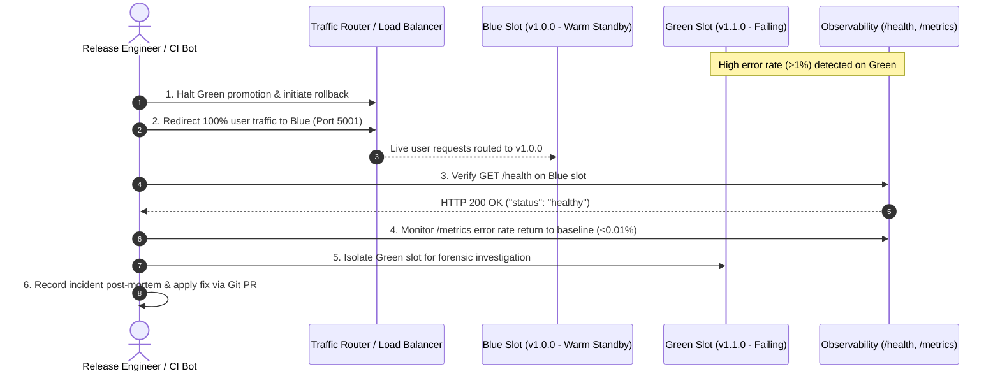

# FinTechFlow – Rollback & Incident Recovery Strategy

## 1. Context: Scenario 1 Rollback Problem

In **Scenario 1**, the fintech organization suffered from:
- **2 to 4 rollbacks per 12-week release window**.
- Traditional "in-place" rollbacks taking **2 to 6 hours** of system downtime.
- High risk of configuration corruption, database schema mismatches, and human error under extreme stress during release weekends.
- 30 staff members scrambling on bridge calls late at night.

---

## 2. In-Place Rollback vs. Blue-Green Rollback

| Metric / Dimension | Traditional In-Place Rollback (Scenario 1) | FinTechFlow Blue-Green Rollback |
| :--- | :--- | :--- |
| **Mean Time to Recover (MTTR)** | 2 – 6 hours | **< 30 seconds** |
| **Downtime during Rollback** | Yes (service offline while binaries are uninstalled/reinstalled) | **Zero Downtime** (traffic routed instantly back to Blue slot) |
| **Risk of Human Error** | High (manual commands executed on live nodes under pressure) | **Near Zero** (single router/Terraform variable toggle) |
| **Previous Version State** | Overwritten / Destroyed during initial upgrade | **Kept warm and fully validated** in Blue slot |
| **Post-Rollback Validation** | Manual spot-checking | **Automated `/health` probe validation** |

---

## 3. Step-by-Step Incident Rollback Runbook

### Scenario Example:
- **Current Live Version (Blue)**: `fintechflow:1.0.0` (Port 5001)
- **Candidate Release (Green)**: `fintechflow:1.1.0` (Port 5002)
- **Trigger**: Post-deployment error spikes detected on Green slot.



### Actionable Runbook Steps:

#### Step 1: Halt Green Promotion
Immediately stop traffic migration or automated ramp-up to the green candidate slot.

#### Step 2: Switch Traffic Back to Blue Slot
Switch the active load balancer target or proxy routing to the blue slot:
```bash
# Using Terraform:
terraform apply -var="active_traffic_slot=blue" -var="app_version=1.0.0" -auto-approve

# Or using Docker Compose Blue-Green simulation:
# Verify Blue is serving traffic on port 5001:
curl -f http://localhost:5001/health
```

#### Step 3: Verify Health on Blue
Execute automated probe against the active slot:
```bash
curl -i http://localhost:5001/health
# Expected Output: HTTP/1.1 200 OK
# {"status":"healthy","service":"FinTechFlow","version":"1.0.0"}
```

#### Step 4: Monitor Application Metrics
Inspect error rates and request distribution:
```bash
curl http://localhost:5001/metrics
```
Verify that `failed_requests` is stable and `successful_requests` is incrementing normally.

#### Step 5: Isolate Green Environment for Forensics
Do not delete the failing green container immediately. Capture container logs and memory dumps for debugging:
```bash
docker logs fintechflow-green > incident-logs-green-v1.1.0.log
```

#### Step 6: Log the Incident & Post-Mortem
Log incident details in the engineering post-mortem repository:
- Incident Start & Recovery Times
- Triggering commit / PR number
- Root cause (e.g., unhandled exception, missing dependency, config mismatch)

#### Step 7: Apply Remediation via Standard Git PR
- Developer creates `fix/hotfix-issue` branch.
- Fix passes full 10-stage CI quality gate (`ruff`, `pytest`, `bandit`, `pip-audit`, `docker build`).
- PR is peer-reviewed, merged to `main`, and re-deployed cleanly.

---

## 4. Rollback Verification Checklist

- [ ] Active traffic target switched to Blue slot (`port 5001` or primary route).
- [ ] `/health` returns HTTP 200 with `status: healthy`.
- [ ] `/version` confirms running version is `1.0.0`.
- [ ] Customer-facing error rates on `/metrics` return to 0.
- [ ] Logs from failing candidate captured to file.
- [ ] Incident notification sent to stakeholder channel.
## Change Record

This document was reviewed as part of the FinTechFlow release and rollback documentation.
