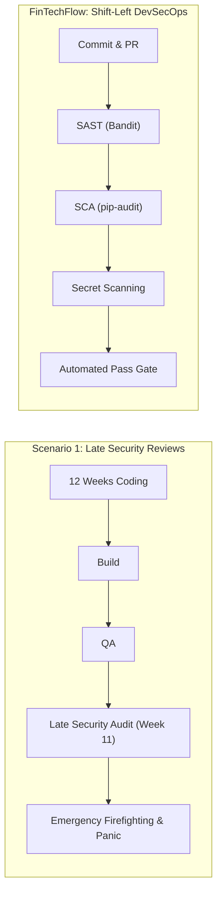

# FinTechFlow – Application Security & DevSecOps Strategy

## 1. Context: Late Security Reviews in Scenario 1

In **Scenario 1**, the organization executed security reviews **late in the 12-week development lifecycle**, typically just days before the scheduled weekend release:
- Critical vulnerabilities uncovered at the 11th hour led to emergency feature cancellation or release aborts.
- Developers received security feedback weeks or months after writing vulnerable code.
- Dependencies were rarely audited, leaving unpatched CVEs in production.

### DevSecOps Shift-Left Principle



By shifting security checks into the continuous integration pipeline, vulnerabilities are discovered in seconds on pull requests before code can ever merge into `main`.

---

## 2. Automated Security Tooling Suite

### A. Static Application Security Testing (SAST) – Bandit
- **Role**: Analyzes Python Abstract Syntax Trees (AST) for common security weaknesses (e.g., hardcoded passwords, insecure cryptographic algorithms, shell injection vulnerabilities, weak temp files).
- **Execution in CI**:
  ```bash
  bandit -r app
  ```
- **Threshold**: Zero high or medium severity issues allowed.

### B. Software Composition Analysis (SCA) – pip-audit
- **Role**: Scans Python runtime and development dependencies against the Python Packaging Advisory Database (PyPA / OSV / CVE feeds) for known security flaws.
- **Execution in CI**:
  ```bash
  pip-audit
  ```
- **Threshold**: Zero known vulnerabilities in installed packages.

### C. Secret Scanning & Configuration Hygiene
- **Zero Committed Secrets Policy**: Real secrets, API tokens, and database passwords are never committed to version control.
- **Template Configuration**: `.env.example` provides safe development placeholders. Real environment variables are injected at runtime via container orchestration or cloud secret managers (e.g., AWS Secrets Manager / Azure Key Vault / HashiCorp Vault).
- **Git Ignore Safeguards**: `.gitignore` strictly excludes `.env`, `*.secret`, `*.key`, `*.tfvars`, and state files.

---

## 3. Defense-in-Depth Implementation Details

### 1. HTTP Security Headers
Every HTTP response issued by `FinTechFlow` includes protective headers configured in `app/__init__.py`:
- `Content-Security-Policy`: Restricts resource loading sources to `'self'` and trusted CDNs.
- `X-Content-Type-Options: nosniff`: Prevents MIME-type sniffing attacks.
- `X-Frame-Options: DENY`: Mitigates clickjacking attacks.
- `X-XSS-Protection: 1; mode=block`: Activates browser XSS filters.
- `Referrer-Policy: strict-origin-when-cross-origin`: Restricts sensitive referrer leakage.

### 2. Container Hardening
The `Dockerfile` adheres to container security best practices:
- **Base Image**: `python:3.12-slim` (minimal attack surface with unnecessary compilers/utilities stripped).
- **Non-Root Execution**: Runs under system user `appuser` (UID 10001) in group `appgroup` (GID 10001).
- **No In-Image Secrets**: Image build receives zero credential arguments; configuration is supplied at runtime via environment variables.

---

## 4. Educational Scope & Limitations

> [!IMPORTANT]
> **Educational Baseline Disclaimer**
> 
> The security checks implemented in this demonstration project (Bandit SAST, pip-audit SCA, HTTP headers, non-root containers) provide an **educational foundation** for DevOps curriculum.
> 
> In a **real-world financial institution (Fintech / Banking)**, these baseline controls must be supplemented by a comprehensive enterprise security program, including:
> - Dynamic Application Security Testing (DAST) and Interactive AST (IAST).
> - Hardware Security Modules (HSM) and Key Management Systems (KMS) for PCI-DSS compliance.
> - Runtime Application Self-Protection (RASP) and Web Application Firewalls (WAF).
> - Regular external third-party penetration testing and threat modeling (STRIDE / DREAD).
> - Formal SOC 2 Type II, ISO 27001, and GDPR / Open Banking regulatory audits.
