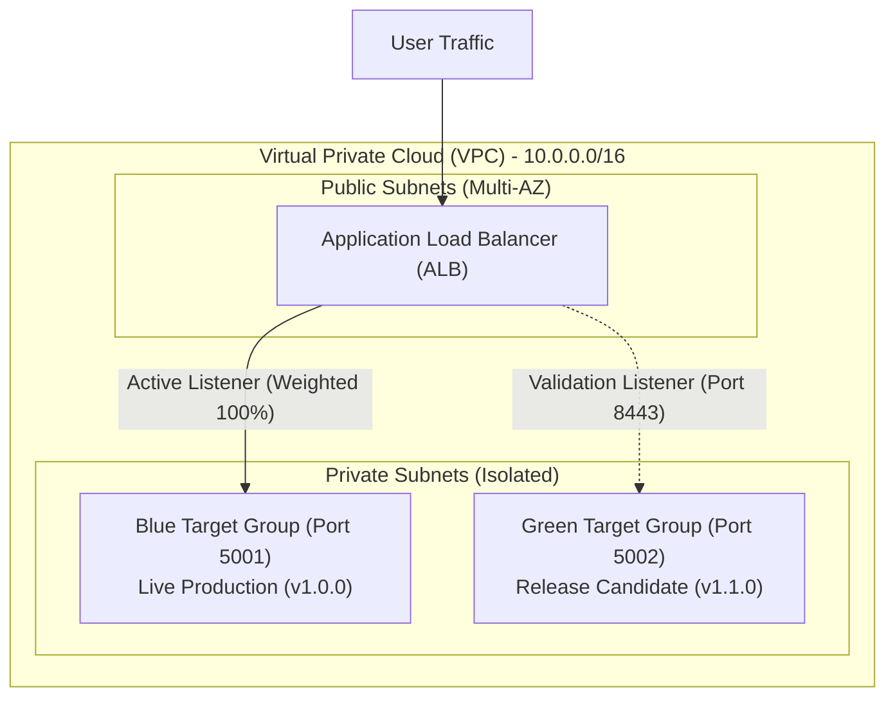

# FinTechFlow – Infrastructure as Code (Terraform)

This directory contains the **Terraform** configuration demonstrating **Infrastructure as Code (IaC)** for the **FinTechFlow** application.

---

## 1. Scenario 1 Problem vs. IaC Solution

| Scenario 1 Pain Point | Manual / Traditional Approach | Terraform IaC Solution |
| :--- | :--- | :--- |
| **Painful Release Weekends** | Engineers manually provision and configure servers during release windows. | Infrastructure is declared in code, version-controlled, and deployed automatically. |
| **Configuration Drift** | Staging and Production environments drift apart over time. | Both environments are spawned from identical, parameterized Terraform modules. |
| **Slow Rollbacks** | Reverting infrastructure changes requires manual, error-prone reconfiguration. | Infrastructure state is captured in code; rolling back is a single parameter change (`active_traffic_slot = "blue"`). |
| **High Staff Requirement** | 30+ staff required on release weekends to coordinate deployment steps. | Repeatable, automated IaC reduces operational overhead to automated CI/CD pipelines. |

---

## 2. Infrastructure Architecture Overview

In a cloud-native production implementation (e.g., AWS, Azure, GCP), Terraform declaratively manages the following layers:



### Managed Infrastructure Layers:
1. **Networking**: VPC creation, public/private subnets across multiple availability zones, internet gateways, NAT gateways, and strict security groups.
2. **Compute & Orchestration**: Container runtime service (AWS ECS Fargate, Azure Container Apps, or Google Cloud Run) executing non-root Docker images.
3. **Traffic Management & Blue-Green Routing**: Application Load Balancer (ALB) with two target groups (`blue` and `green`) allowing instant traffic switching with zero downtime.
4. **Configuration & Secrets**: Centralized parameter injection and Secrets Manager references (preventing hardcoded credentials).
5. **Observability**: CloudWatch / Prometheus alarm rules monitoring `/health` response codes and `/metrics` request counts.

---

## 3. Terraform Files in This Directory

- **`main.tf`**: Core declarative infrastructure model defining providers, deployment metadata, infrastructure manifest generation, and blue-green routing logic.
- **`variables.tf`**: Input variables for target environment, container ports, application version, and active traffic slot.
- **`outputs.tf`**: Readout values for active service URLs, health check probes, and deployment manifests.

---

## 4. Execution & Validation Commands

Run these standard Terraform commands to format, validate, and simulate deployment:

```bash
# 1. Initialize Terraform provider plugins
terraform init

# 2. Check code formatting compliance
terraform fmt -check

# 3. Validate syntax and configuration integrity
terraform validate

# 4. Generate an execution plan
terraform plan

# 5. Apply the configuration (Generates local deployment manifests)
terraform apply -auto-approve

# 6. Simulate Blue-to-Green release traffic switch
terraform apply -var="active_traffic_slot=green" -var="app_version=1.1.0" -auto-approve

# 7. Clean up provisioned resources
terraform destroy -auto-approve
```

---

## 5. Environment Consistency

By using the `environment` variable (`development`, `staging`, `production`), the same Terraform codebase can spin up:
- A lightweight **Development** environment for integration testing.
- An exact **Staging** replica of production for release validation and smoke tests.
- A hardened, multi-zone **Production** environment with blue-green deployment slots.
